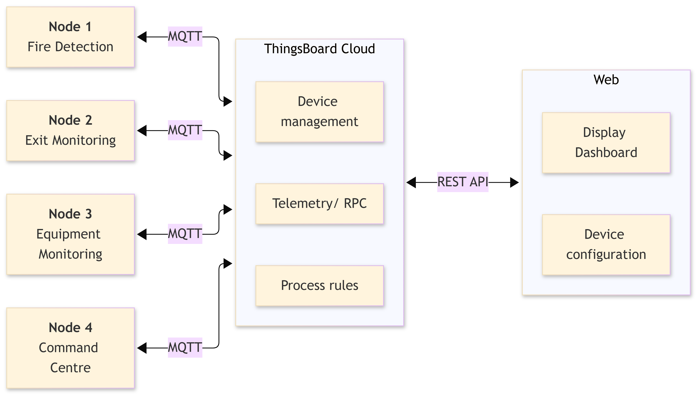

# Smart Multi-Zone Evacuation & Safety System

SWE30011 IoT project for monitoring and controlling four building safety zones.

Each physical node runs its own edge service. ThingsBoard handles MQTT telemetry, alarms and RPC, while FastAPI and Vue provide the shared web interface.

## Architecture



The edge service is the only process that opens the Arduino serial port. FastAPI communicates with ThingsBoard and never accesses the hardware directly.

The web application uses fresh ThingsBoard telemetry when available. If a node is unavailable or its telemetry becomes stale, the UI uses clearly labelled `SIMULATED` data instead.

## Project nodes

| Node | Zone | Purpose |
| --- | --- | --- |
| Node 1 | Kitchen / Lab | Fire detection |
| Node 2 | Hallway | Exit monitoring |
| Node 3 | Equipment Room | Sound and vibration monitoring, buzzer and relay control |
| Node 4 | Command Centre | Manual emergency input and central status display |

## Node 3

Node 3 is the current physical reference implementation.

See the [Node 3 contract](docs/contracts/node3.md) for hardware, telemetry, RPC and verification details.

## Node 4

Node 4 is the command centre: a manual emergency button, a status display, and a master alarm, with remote lockdown control over ThingsBoard RPC.

See the [Node 4 contract](docs/contracts/node4.md) for hardware, telemetry, RPC and verification details.

## Setup

```powershell
cd C:\iot\a3

py -3 -m venv .venv
.\.venv\Scripts\python.exe -m pip install -r requirements-dev.txt

Copy-Item .env.example .env
notepad .env

pnpm --dir frontend install --frozen-lockfile
```

The root `.env` contains only FastAPI's ThingsBoard REST settings. Each physical edge keeps its own serial and MQTT settings; for Node 3, copy `devices/node3/.env.example` to `devices/node3/.env`. The frontend requires no `.env` for the default setup.

On an edge-only VM, install `requirements-edge.txt` instead of the full web stack.

## Run

### Node 3 edge

Close Arduino Serial Monitor first, then run:

```powershell
.\.venv\Scripts\python.exe -m devices.node3.edge.main
```

### Node 4 edge

Close Arduino Serial Monitor first, then run:

```powershell
.\.venv\Scripts\python.exe -m devices.node4.edge.main
```

### FastAPI

```powershell
.\.venv\Scripts\python.exe -m uvicorn backend.app.main:app --reload --port 8000
```

### Vue

```powershell
pnpm --dir frontend run dev
```

Production build:

```powershell
pnpm --dir frontend run build
```

### Tests

```powershell
.\.venv\Scripts\python.exe -m pytest -q
```

## ThingsBoard

Each physical edge node uses its own ThingsBoard device access token for MQTT.

FastAPI uses the ThingsBoard REST API for:

- device management
- telemetry and history
- alarms
- RPC
- cloud configuration

Do not commit `.env` files or device credentials.

## Project structure

```text
backend/app/nodes/       Shared node contracts and registry
backend/app/services/    ThingsBoard REST integration
devices/                 Firmware and edge services for each node
frontend/                Vue monitoring and control application
docs/contracts/          Device telemetry and RPC contracts
tests/                   Automated tests
tools/                   Diagnostic utilities
```

## Documentation

- [Add a physical node](docs/adding-a-node.md)
- [ThingsBoard setup](cloud/thingsboard/README.md)
- [Node 3 contract](docs/contracts/node3.md)
