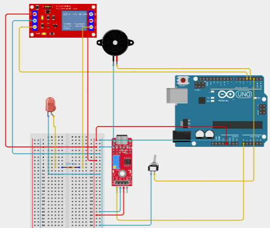

# Node 3 — Equipment Room

Device name: `node-3-equipment-room`

Node 3 monitors sound and movement in the equipment room and controls a buzzer and low-voltage relay load.

## Hardware



| Component | Connection | Purpose |
| --- | --- | --- |
| Sound sensor | `A -> A0`, `5V -> 5V`, `GND -> GND` | Sound level |
| Ball switch | `D2 -> switch -> GND`, using `INPUT_PULLUP` | Movement / vibration indication |
| Passive buzzer | `+ -> D3`, `- -> GND` | Audible alarm |
| 5V relay | `SIG -> D4`, `5V -> 5V`, `GND -> GND` | Low-voltage equipment control |
| LED/load | Connected through relay screw terminals | Relay-controlled load indicator |

## Telemetry

The Arduino sends one telemetry frame approximately once per second.

| Key | Type | Description |
| --- | --- | --- |
| `sound_level` | Integer `0–1023` | Maximum ADC reading from the sound sampling window |
| `vibration_detected` | Boolean | Ball switch state |
| `relay_state` | Boolean | Current relay state |
| `buzzer_state` | Boolean | Current buzzer state |

Example:

```json
{
  "sound_level": 412,
  "vibration_detected": true,
  "relay_state": false,
  "buzzer_state": false
}
```

`equipment_fault` is a derived cloud state rather than a physical sensor reading.

## RPC

ThingsBoard sends RPC commands to the edge. The edge converts them to Arduino serial commands and waits for the matching ACK.

| RPC | `true` | `false` |
| --- | --- | --- |
| `setRelay` | `RELAY_ON` | `RELAY_OFF` |
| `setBuzzer` | `BUZZER_ON` | `BUZZER_OFF` |
| `setAll` | `ALL_ON` | `ALL_OFF` |

Example response:

```json
{
  "success": true,
  "method": "setRelay",
  "relay_state": true
}
```

A command is successful only after the edge receives the matching acknowledgement, for example:

```text
RELAY_ON
ACK=RELAY_ON
```

## ThingsBoard flow

```text
Arduino
   ↓ serial telemetry
Python edge
   ↓ MQTT
ThingsBoard
   ↓ RPC
Python edge
   ↓ serial command
Arduino
   ↓ ACK
Python edge
   ↓ RPC response
ThingsBoard
```

## Source status

The web application displays each node as:

- `LIVE` — fresh ThingsBoard telemetry is available.
- `SIMULATED` — live telemetry is unavailable or stale.

Simulated values are only used by the web interface and are not published to ThingsBoard.

## Edge configuration

Node 3 uses:

```text
DEVICE_ID
SERIAL_PORT
SERIAL_BAUD_RATE
SERIAL_TIMEOUT
POLL_INTERVAL
ACK_TIMEOUT

THINGSBOARD_ENABLED
THINGSBOARD_HOST
THINGSBOARD_PORT
THINGSBOARD_ACCESS_TOKEN
THINGSBOARD_TLS
```

`THINGSBOARD_ACCESS_TOKEN` identifies the MQTT device and must not be committed.

## Verification

1. Upload `devices/node3/firmware/node3.ino`.
2. Close Arduino Serial Monitor.
3. Start the Node 3 edge service.
4. Confirm telemetry updates in ThingsBoard.
5. Trigger the sound sensor and ball switch.
6. Test `setRelay` and `setBuzzer`.
7. Confirm the physical output and matching ACK.
8. Verify the updated state is returned to ThingsBoard.

Useful command:

```powershell
.\.venv\Scripts\python.exe -m devices.node3.edge.main
```