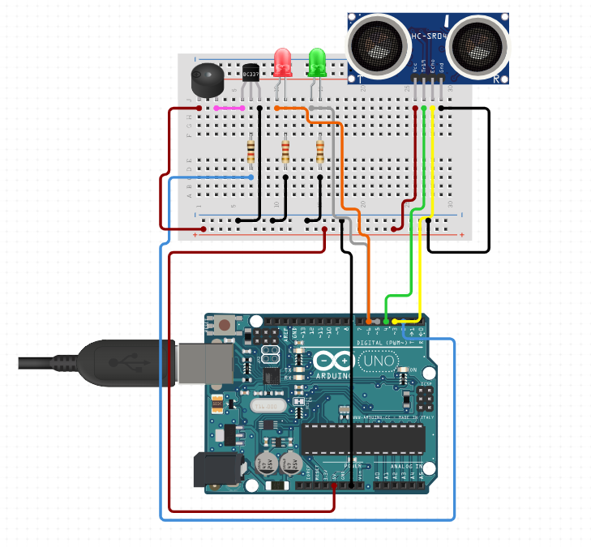

# Node 2 (Hallway Exit Monitoring): step-by-step setup guide

**Owner:** Abdul Muqtadir. Node 2 plus MQTT integration.
**Goal:** get Node 2 working from wiring through to the cloud, collect the evidence for the report, and push the code to the team repository.

The code is already written. You will find it in `devices/node2/`. This guide walks you through running it on your own hardware.

---

## 0. What you need

Everything comes from the **ELEGOO UNO R3 Super Starter Kit**:

| Item | Name on the kit card | Notes |
| --- | --- | --- |
| Arduino board + USB cable | "UNO R3 Controller Board", "USB Cable" | |
| Ultrasonic distance sensor | "Ultrasonic Sensor" (HC-SR04) | 4 pins: VCC, Trig, Echo, GND |
| 1 × green LED, 1 × red LED | "Green LED", "Red LED" | Long leg = + |
| 2 × 220 Ω resistors | "Resistor" bag | 220 Ω bands: red-red-black-black-brown (5-band) or red-red-brown (4-band) |
| Passive buzzer | "Passive Buzzer" | **Not** the active buzzer. The passive one has a green circuit board visible underneath. The active one is sealed and has a sticker on top. |
| NPN transistor | "NPN Transistor PN2222" or "NPN Transistor S8050" | Drives the buzzer. Your diagram shows a BC337, which is not in this kit. Either kit transistor works, **but it must go in the other way round**. See the transistor note in section 1. |
| 1 × 1 kΩ resistor | "Resistor" bag | For the transistor base. Bands: brown-black-black-brown-brown (5-band) or brown-black-red (4-band) |
| Breadboard + jumper wires | "830 Tie-Points Breadboard", "Breadboard Jumper Wire" | |
| Windows laptop (or the team's Debian VM) | – | This is the "edge" computer that talks to ThingsBoard |
| Software | – | Arduino IDE 2.x, Python 3.11+, Git, VS Code (optional) |
| ThingsBoard Cloud login | – | Same tenant account the team uses (Rohan set it up) |

> The ELEGOO UNO appears in Arduino IDE as **Arduino Uno** on a COM port. If no port appears, install the board's USB driver from the ELEGOO tutorial download (CH340 driver for some board revisions).

---

## 1. Wire the hardware

Unplug the Arduino from USB before you wire anything.

This matches the wiring diagram [`docs/node2-wiring.png`](node2-wiring.png):



| Part | Part pin | Connects to |
| --- | --- | --- |
| HC-SR04 | Vcc | 5V rail (+) |
| HC-SR04 | Trig | **D4** |
| HC-SR04 | Echo | **D3** |
| HC-SR04 | Gnd | GND rail (−) |
| Red LED | long leg (+) | **D6** |
| Red LED | short leg (−) | 220 Ω → GND rail |
| Green LED | long leg (+) | **D5** |
| Green LED | short leg (−) | 220 Ω → GND rail |
| Passive buzzer | + | 5V rail (+) |
| Passive buzzer | − | transistor **collector** |
| NPN transistor | base (middle leg) | 1 kΩ → **D2** |
| NPN transistor | emitter | GND rail (−) |
| Arduino | 5V | breadboard + rail |
| Arduino | GND | breadboard − rail |

**Transistor note (important).** Pins are read with the **flat face towards you, legs down**:

| Transistor | Left | Middle | Right |
| --- | --- | --- | --- |
| BC337 (in the diagram) | Collector | Base | Emitter |
| PN2222 / S8050 (in your kit) | **Emitter** | Base | **Collector** |

So if you use the PN2222 or S8050, **turn it round** (flat face away from you) in the same three holes. The collector then lands on the buzzer side and the emitter on the GND wire. If you put it in the wrong way, the buzzer will be very quiet or silent. Nothing gets damaged, so just flip it.

**Check the power rails.** On some 830-point breadboards the + and − rails are split in the middle (look for a gap in the red/blue line). If yours is split, add a short jumper across the gap, or the HC-SR04 on the right-hand side gets no power.

Tips:
- Point the HC-SR04 across the "exit" (for example a doorway or the end of your desk). Nothing should be in front of it closer than about 60 cm when the exit is clear.
- Take a **photo of the wiring now**. You need it for the report (Evidence Checklist: "Photo of physical Node 2 hardware").

---

## 2. Upload the Arduino sketch

1. Open **Arduino IDE**.
2. **File → Open** `devices/node2/firmware/node2/node2.ino`.
3. **Tools → Board → Arduino Uno**, then **Tools → Port** and pick the COM port that shows up when you plug in the Arduino (for example `COM4`).
4. Click **Upload** (the → arrow). No extra libraries are needed. `EEPROM` comes built in.
5. Open **Tools → Serial Monitor** and set it to **9600 baud** with **Newline** line ending.

You should see one line per second, like this:

```text
distance_cm=123.4, exit_blocked=false, threshold_cm=50, evacuation_mode=false, exit_closed=false, buzzer_state=false, sensor_ok=true
```

### Test it locally (before any cloud)

| Do this | You should see |
| --- | --- |
| Nothing in front of the sensor | Green LED **on**, `exit_blocked=false` |
| Hold your hand/a box 10–40 cm in front of the sensor (not touching it) for **3 seconds** | Red LED **on**, `exit_blocked=true` |
| Move it away for 2 seconds | Back to green |
| Type `EVAC_ON` in Serial Monitor and press Enter | `ACK=EVAC_ON`, green LED **flashes** |
| Block the sensor while EVAC is on | Red LED + buzzer **pulses** |
| Type `EXIT_CLOSE` | `ACK=EXIT_CLOSE`, red LED on even with nothing in front |
| Type `EXIT_OPEN`, then `EVAC_OFF` | Back to normal |
| Type `THRESHOLD=30` | `ACK=THRESHOLD=30`, telemetry shows `threshold_cm=30` |
| Type `BUZZER_ON` / `BUZZER_OFF` | Buzzer on / off |

**Calibrate the threshold:** with the exit clear, note the normal `distance_cm`. Pick a threshold a bit below that (for example, if the clear reading is 80 cm, use 50 cm). Write the number down because the report asks for it. The value is saved in the Arduino's memory, so it survives a reboot.

**Close the Serial Monitor when you finish.** Only one program can use the COM port, and the Python edge needs it.

---

## 3. Get the code on your laptop

Open **PowerShell**:

```powershell
cd C:\
mkdir iot -ErrorAction SilentlyContinue
cd C:\iot
git clone https://github.com/amuqtadir99/Assignment-4Dev---IoT-Programming.git a3
cd a3
```

If the Node 2 pull request in your repo is not merged yet, switch to its branch:

```powershell
git checkout claude/zen-dirac-c8g0pi
```

---

## 4. Set up Python (one time)

```powershell
py -3 -m venv .venv
.\.venv\Scripts\python.exe -m pip install -r requirements-dev.txt
```

Check that everything installed and the tests pass:

```powershell
.\.venv\Scripts\python.exe -m pytest -q
```

You should see `30 passed`.

> **Using the Debian VM instead?** Run `python3 -m venv .venv` and `.venv/bin/python -m pip install -r requirements-edge.txt`, and use `/dev/ttyACM0` as the serial port. You also need to pass the Arduino's USB through to the VM (VirtualBox → Devices → USB → tick the Arduino).

---

## 5. Create the Node 2 device in ThingsBoard

1. Log in to <https://thingsboard.cloud> with the team account.
2. Go to **Entities → Devices**. If `node-2-exit-monitoring` is already there (Rohan may have created it), open it. If not, click **+ → Add new device** and name it exactly:
   ```
   node-2-exit-monitoring
   ```
   The name must match exactly, because the web app looks the device up by this name.
3. Open the device and click **Copy access token**.
4. On the device's **Attributes** tab, choose **Shared attributes → +**, add key `threshold_cm`, type **Integer**, value `50` (or your calibrated number).

---

## 6. Configure and start the Node 2 edge

```powershell
Copy-Item devices\node2\.env.example devices\node2\.env
notepad devices\node2\.env
```

In Notepad:
- paste the token after `THINGSBOARD_ACCESS_TOKEN=`
- set `SERIAL_PORT=COM4` (your port), or leave it blank to auto-detect

Save and close. **Never commit this `.env` file.** It is already in `.gitignore`.

Start the edge (Serial Monitor must be closed):

```powershell
.\.venv\Scripts\python.exe -m devices.node2.edge.main
```

Good log lines look like this:

```text
Serial connected on COM4 at 9600 baud
Connected to ThingsBoard MQTT; RPC and attribute subscriptions requested
MQTT telemetry publish payload={"distance_cm":123.4,"threshold_cm":50,...} result=0
```

Leave this window running. Press **Ctrl + C** to stop it.

---

## 7. Check the cloud side

1. ThingsBoard → device `node-2-exit-monitoring` → **Latest telemetry**. All seven keys should update every second.
2. **Test RPC from ThingsBoard.** Create a dashboard (or add to the team dashboard):
   - **Switch control** widget → RPC method `setEvacuation` (also do `setExitClosed` and `setBuzzer`)
   - **Knob control** widget → RPC method `setThreshold`, min 5, max 300
   - **Time-series chart** → `distance_cm` and `threshold_cm`
   - **LED indicator** widgets → `exit_blocked`, `exit_closed`, `sensor_ok`
3. Flip each switch. The LEDs/buzzer must change, and the edge window should log `Arduino acknowledgement: ACK=...`.
4. **Test remote configuration:** change the shared attribute `threshold_cm` to `30`. Within a second the telemetry `threshold_cm` becomes 30.
5. **Test the stale/disconnect case:** unplug the Arduino USB. Within 5 seconds the edge logs `reporting sensor_ok=false`. Plug it back in and it recovers by itself.
6. **Test reconnect** (the MQTT evidence you own): turn Wi-Fi off for about 10 seconds, then back on. The log shows `disconnected ... reconnect is automatic`, then `Connected to ThingsBoard MQTT`. Screenshot it.

## 8. Add the ThingsBoard rules

Follow `cloud/thingsboard/node2-rule-notes.md`. Kha Anh owns the rules engine, so coordinate with them. At minimum:
- **Exit Blocked** alarm (`exit_blocked == true`)
- **Exit Sensor Fault** alarm (`sensor_ok == false`)
- **Cross-node:** Node 1 `fire_detected == true` → RPC `setEvacuation(true)` to Node 2
- **Multi-source:** fire detected **and** exit blocked → critical alarm + `setLockdown(true)` on Node 4

## 9. Check it in the team web app

In two more PowerShell windows (from `C:\iot\a3`):

```powershell
Copy-Item .env.example .env      # first time only; ask Rohan for THINGSBOARD_API_KEY
.\.venv\Scripts\python.exe -m uvicorn backend.app.main:app --reload --port 8000
```

```powershell
pnpm --dir frontend install --frozen-lockfile   # first time only
pnpm --dir frontend run dev
```

Open the address Vite prints (usually <http://localhost:5173>):
- **Overview**: Node 2 should switch from `SIMULATED` to `LIVE`.
- **Control**: pick Node 2 and use **Evacuation guidance**, **Close exit route** and **Buzzer**.

## 10. Evidence to capture (for the report and video)

- [ ] Photo of the Node 2 wiring, plus the green, red and flashing states
- [ ] Serial Monitor showing telemetry and an `ACK=` line
- [ ] Edge log showing MQTT connect, publish, RPC received and ACK
- [ ] ThingsBoard Latest telemetry for Node 2
- [ ] ThingsBoard RPC switch → LED change (short video clip)
- [ ] Shared attribute `threshold_cm` change → telemetry change
- [ ] Exit Blocked alarm in ThingsBoard
- [ ] Reconnect log after Wi-Fi off/on
- [ ] Web app Overview showing Node 2 LIVE, and the Control page

---

## 11. Push your code to the shared team repository

The team repo is `https://github.com/Leissha/Smart-Multizone-Evacuation-System`. The team works with **one branch per node, then a pull request into `master`**, the same way Node 4 was added.

### 11a. Make sure you can push

Ask Lisa (the repo owner) to add your GitHub account `amuqtadir99` as a collaborator: **Settings → Collaborators → Add people**. Accept the email invite. (If that is not possible, see 11d.)

### 11b. Get the ready-made Node 2 branch

A branch with Node 2 already applied on top of the team's latest `master` is kept in your own repo as `claude/zen-dirac-c8g0pi`. From `C:\iot\a3`:

```powershell
git remote add team https://github.com/Leissha/Smart-Multizone-Evacuation-System.git
git fetch origin
git checkout -b node-2-exit-monitoring origin/claude/zen-dirac-c8g0pi
.\.venv\Scripts\python.exe -m pytest -q
```

If `git remote add` says the remote already exists, carry on. The tests should report `32 passed`.

### 11c. Push and open the pull request

```powershell
git push -u team node-2-exit-monitoring
```

Then on GitHub, open the team repo. You'll see a yellow **Compare & pull request** banner:
- **base:** `master`  ←  **compare:** `node-2-exit-monitoring`
- Title: `Add Node 2 exit monitoring (ultrasonic, LEDs, buzzer, RPC + shared attributes)`
- Ask a teammate to review, then merge.

### 11d. If you cannot get write access (fork route)

1. On the team repo page click **Fork**. This creates `amuqtadir99/Smart-Multizone-Evacuation-System`.
2. `git remote add fork https://github.com/amuqtadir99/Smart-Multizone-Evacuation-System.git`
3. `git push -u fork node-2-exit-monitoring`
4. On GitHub, open a pull request from your fork's branch into `Leissha/...:master`.

### Never commit

- `devices/node2/.env` or the root `.env` (they contain tokens)
- `.venv/`, `frontend/node_modules/`

Run `git status` before every commit to check.

---

## Troubleshooting

| Problem | Fix |
| --- | --- |
| `Serial connection failed: could not open port 'COM4': PermissionError` | Close the Arduino Serial Monitor (or any other program using the port) |
| `distance_cm` is always 400 | Check TRIG/ECHO are not swapped and VCC is on **5V** |
| `distance_cm` jumps around | Make sure the sensor points at a flat surface. The median filter and 3 s hold already handle small noise |
| `ThingsBoard token missing` | `devices/node2/.env` not created, or token not pasted |
| `connection rejected: Not authorized` | Wrong token. Copy it again from the device page |
| RPC times out in ThingsBoard | Edge not running, or the Arduino is unplugged. Check the edge log for `ACK=` |
| Web app still shows SIMULATED | Device name must be exactly `node-2-exit-monitoring`, and the root `.env` needs the API key |
